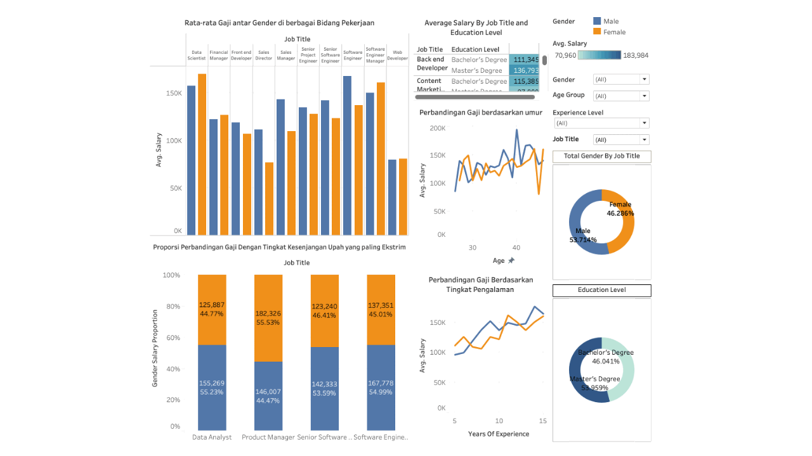
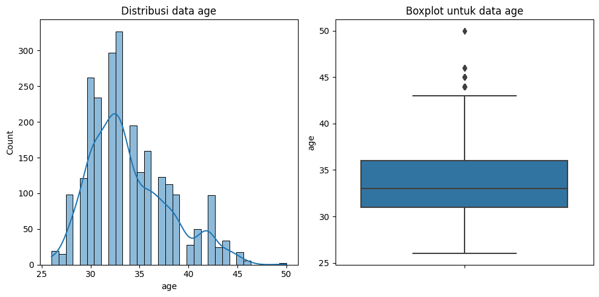
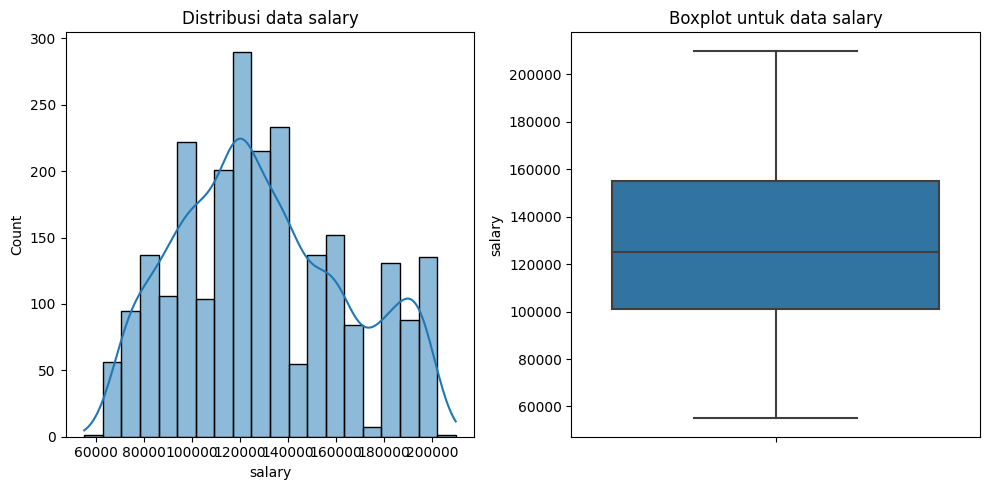
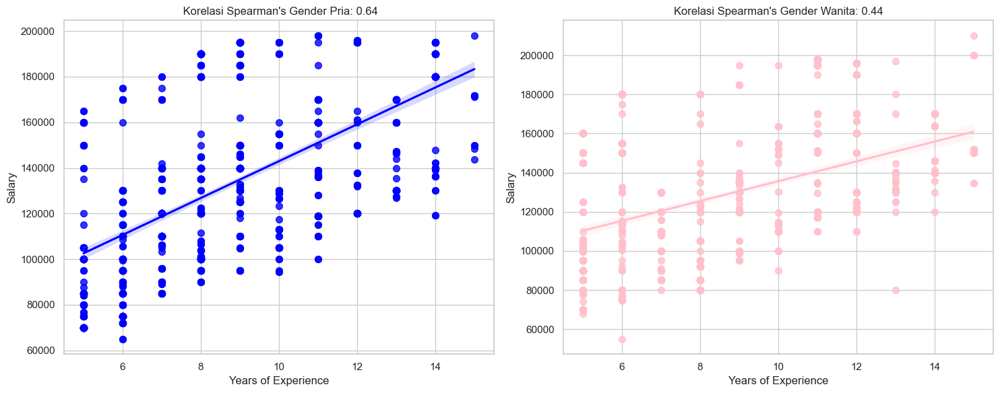

# Gender Pay Gap Analysis using Employee Salary Data

## Table of Contents

- [Project Overview](#project-overview)
- [Data Sources](#data-sources)
- [Results and Findings](#result-and-findings)

### Project Overview
---

Performed an exploratory data analysis (EDA) on a Kaggle dataset to investigate the gender wage gap, focusing on factors like age, job position, education, and work experience. Utilized Tableau for visual representation and conducted a correlation analysis which revealed a disparity in wage progression between male and female employees with 5-15 years of experience and at least a bachelor's education. The differing Spearman coefficients (men: 0.64, women: 0.44) indicated a gender bias, suggesting that men with similar education and experience benefit more in terms of salary increases than their female counterparts.

### Data Sources

The dataset used is a dataset from Kaggle which, based on its source, is part of a collection of data obtained from various sources, including surveys, job vacancy sites, and other publicly available sources. Overall, this dataset consists of 6704 employee data which includes five variables: age (`Age`), gender (`Gender`), education level (`Education Level`), position (`Job Title`), work experience ( `Years of Experience`), and salary (`Salary`). This data was obtained under license from the Kaggle website with the following [link](https://www.kaggle.com/datasets/mohithsairamreddy/salary-data?datasetId=3282301&sortBy=dateRun)

### Tools

- Python, Pandas, NumPy, - Data Cleaning and Manipulation
- Matplotlib, Seaborn - EDA Visualization
- SciPy - Statistic Inferential
- Tableau Public - Dashboard Visualization

### Data Preparation

In the initial data preparation phase, I performed the following tasks:
1. Data loading and inspection
2. Removing Unnecessary Columns and Filter data according to analysis criteria
3. Change column naming to conform to good naming conventions
4. Data cleaning and formatting
5. Handling missing values

### Exploratory Data Analysis

EDA involved exploring the data to answer key questions, such as:
- Between male or female gender, who receives a higher average salary for the same position?
- Are there specific positions where the wage gap is most extreme?
- When comparing employees by age, are younger or older employees more affected by the gap?
- Where is this pay gap most evident – middle level, junior level or senior positions?
- Why is it possible that employees of different genders but with the same work experience and education level do not receive the same salary?
- How can the results of this analysis provide insight into the conditions of equality and justice in the real world today?

### Descriptive Statistic

This analysis will use descriptive statistics to provide more meaningful insights based on data. Specifically, this data analysis will answer whether there is a possibility that differences in employee gender affect the salary they receive. For the purposes of this analysis, an evaluation will first be carried out on the sample data collected so as to get a clearer picture regarding the behavior of this research sample data. Based on the sample data obtained, this descriptive statistical analysis will provide an overview of the variable elements that are used as the basis for the analysis.

|       | age | years_of_experience | salary       |
|-------|-----|--------------------|--------------|
| count | 2450| 2450               | 2450.000000  |
| mean  | 34  | 8.5                | 129651.958776|
| std   | 4.1 | 2.7                | 34924.055014 |
| min   | 26  | 5                  | 55000.000000 |
| 25%   | 31  | 6                  | 101046.500000|
| 50%   | 33  | 8                  | 125000.000000|
| 75%   | 36  | 11                 | 155000.000000|
| max   | 50  | 15                 | 210000.000000|

Explanation of Descriptive Statistics:
- Count' describes data containing 2,450 observations for each variable ('age', 'year_of_experience', and 'salary').
- 'age': The average age ('mean') in this data is around 34 years. The standard deviation ('std') for age is approximately 4 years, indicating the range of spread of the age data. The youngest person in this data is ('min') 26 years old, and the oldest is ('max') 50 years old. 50% of people are aged 33 years or younger ('median'), with 25% of all data aged 31 years or younger and another 25% aged 36 years or older.
- 'year_of_experience': The average ('mean') for years of work experience is approximately 8.5 years. The standard deviation ('std') for work experience is approximately 2.77 years, indicating a reasonable range for variability in work experience. Data on workers with the minimum ('min') work experience is 5 years of experience, and the most experienced ('max') is 15 years. 50% of the individuals in this data have an age range of between 6 and 11 years of experience.
- 'salary': The average ('mean') salary is approximately $129,652. The standard deviation ('std') for salaries is approximately $34,900, indicating considerable variation in salary data. The lowest ('min') salary is $55,000 and the highest ('max') is $210,000. Half of the individuals (the 'median') earned $125,000 or less, with 25% earning $101,000 or less and another 25% earning $155,000 or more.

Based on histogram and boxplot graphs:
- It can be seen that the 'salary' data has a curve that resembles a bell-shaped shape and is almost symmetrical and for the boxplot graph there are also significant outlier values, so that the data tends to be identical to normally distributed characteristics.
- In the 'age' data, it can be seen that the data distribution tends to be skewed to the right (positive skew) indicating that there are outliers in the data, which indicates that there are values that are far above the average which can also be identified in the boxplot, so there is a tendency for the data to not be normally distributed.

### Inferential Statistic

To analyze more deeply the existence of the Gender Wage Gap, this analysis will use Spearman correlation. In this case, this analysis will identify the Spearman rank correlation coefficient value for male and female gender. From the results of this coefficient, we can interpret and compare how the relationship between employee work experience and 'salary' is correlated, and compare the results of this analysis for men and women.

### Results and Findings

The analysis results are summarized as follows:
1. Analysis for male gender: The coefficient of 0.64 implies that there is a fairly strong positive relationship between the work experience of male employees and the salary they earn. In simpler terms, as years of work experience increase, male gender salaries tend to increase.
2. Analysis for female gender: The coefficient of 0.44 implies a moderate or moderate positive relationship between the work experience of female employees and the salary they receive. This shows that although the results of this analysis state that there is a positive correlation, the strength of the correlation is relatively weaker compared to the male gender. This also shows that the professional work experience possessed by A man has a greater impact on increasing the salary earned compared to a woman with equal education and experience criteria. This could be an indication of a gender pay gap where women may not see as much of a salary increase with additional years of experience as men do.
3. Interpreting P-values:
A p value of 0.00 (or very close to zero) for both analysts means that the observed correlation is statistically significant. In other words, it is unlikely that the relationship observed from this statistical analysis occurred due to chance alone, so that it can be statistically proven to be true that employee work experience greatly influences the salary received by employees and female employees.

### Limitations

- It would be more useful to carry out additional analysis, such as regression analysis, to calculate several factors simultaneously and measure the impact more comprehensively. 
- Investigating additional analyzed variables would be more relevant to provide a clearer understanding. For example, examining more specific industry differences, job roles, performance indicators, or other relevant factors could explain observed wage differences.

### References

1. [Kaggle](https://www.kaggle.com/datasets/mohithsairamreddy/salary-data?datasetId=3282301&sortBy=dateRun)
2. [SciPy documentation](https://docs.scipy.org/doc/scipy/)
3. [Tableau Public Tutorial](https://help.tableau.com/current/guides/get-started-tutorial/en-us/get-started-tutorial-home.htm)

